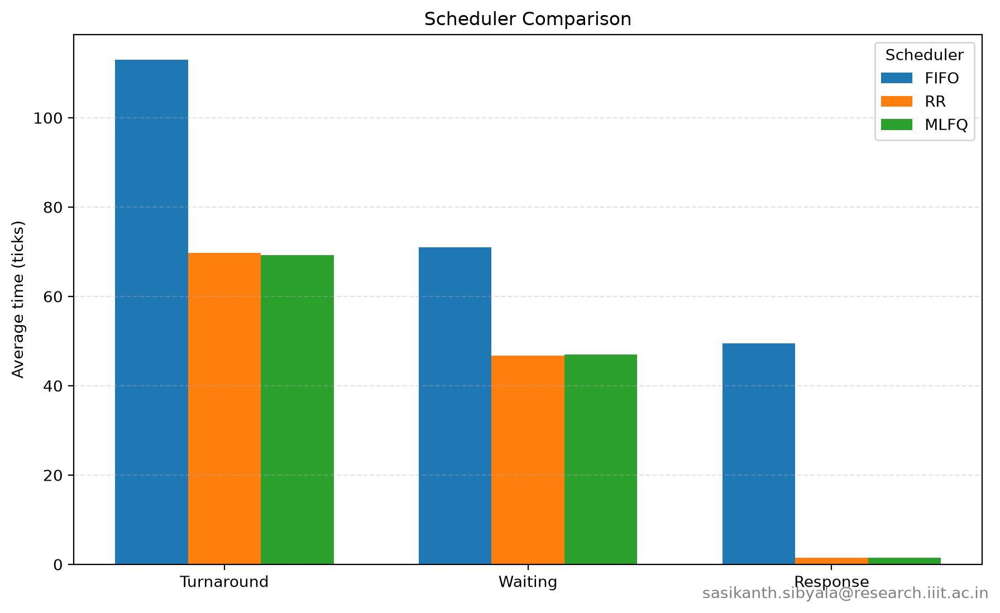
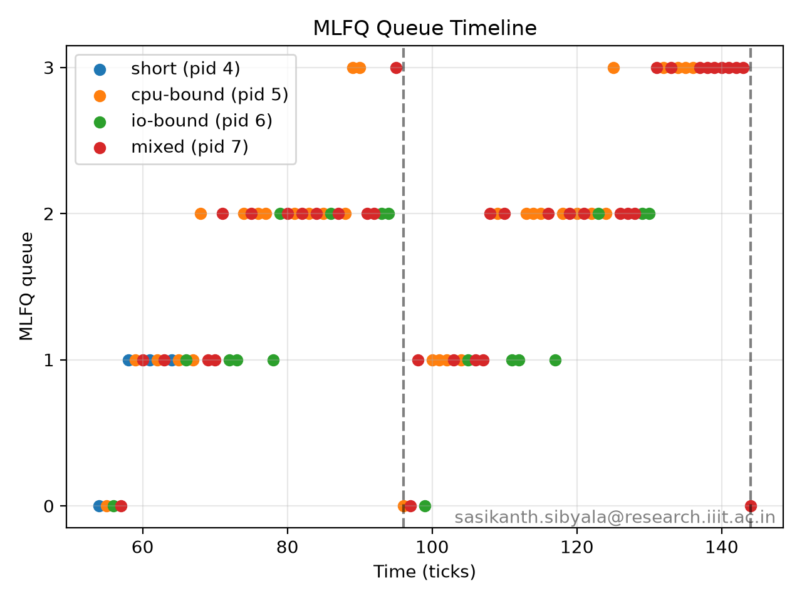

# MLFQ Scheduler Report

## Implementation Summary

### Build System

The Makefile selects MLFQ or FIFO at compile time. Without a flag, xv6 uses RR.

### Process State and Creation

Each process stores its MLFQ queue and slice usage. New processes start in
queue 0, and timing fields are recorded for the test program.

### Queue Selection and Demotion

The scheduler checks queues 0 through 3 in priority order. The time slices are
1, 4, 8, and 16 ticks; a process that uses its full slice moves down one queue.
Queue 3 uses round robin.

### Voluntary Yield and Boosting

Sleeping processes keep their current queue and return to its tail when woken.
Every 48 ticks, active processes are moved back to queue 0.

### `procdump` and Tracing

`procdump()` shows queue and slice information. Trace messages record queue
samples, demotions, and boosts for the timeline plot.

## Test Workload

The custom `schedulertest` program creates four children:

| Process | CPU burst | Sleep | Rounds |
| --- | ---: | ---: | ---: |
| short | 3 ticks | 0 | 4 |
| cpu-bound | 20 ticks | 0 | 4 |
| io-bound | 2 ticks | 4 ticks | 12 |
| mixed | 8 ticks | 2 ticks | 8 |

All measurements were collected with `CPUS=1` using the same workload.

## Scheduler Comparison

| Scheduler | Avg. Turnaround | Avg. Waiting | Avg. Response |
| --- | ---: | ---: | ---: |
| FIFO | 113.00 | 71.00 | 49.50 |
| RR | 69.75 | 46.75 | 1.50 |
| MLFQ | 69.25 | 47.00 | 1.50 |

The comparison chart is shown below and is also in `scheduler_comparison.png`.

### Turnaround

FIFO has the highest turnaround time because later processes wait for older
processes to finish. RR reduces turnaround by sharing the CPU regularly. MLFQ
has the lowest turnaround because short and new processes receive higher
priority.

### Waiting

FIFO has the highest waiting time, especially for the I/O-bound and mixed
processes. RR gives runnable processes regular turns, so their waiting time is
lower. MLFQ demotes CPU-bound processes and prioritizes shorter jobs, producing
similar waiting time to RR for this workload.

### Response

FIFO has the highest response time because later processes cannot run until
older processes finish. RR has a low response time because it cycles through
runnable processes. MLFQ also has a low response time because new processes
start in the highest-priority queue.

## MLFQ Analysis

The timeline plot is shown below and is also in `mlfq_timeline.png`.

### Short Process

The short process starts in queue 0 and finishes quickly after using a small
number of CPU bursts.

### CPU-Bound Process

The CPU-bound process starts in queue 0 and is gradually demoted through queues
1, 2, and 3 because it repeatedly uses its complete time slice.

### I/O-Bound Process

The I/O-bound process starts in queue 0, uses short CPU bursts, and sleeps
between bursts. Since it often gives up the CPU voluntarily, it does not move
down as quickly as the CPU-bound process.

### Mixed Process

The mixed process starts in queue 0 and alternates between CPU bursts and
sleeping. It is gradually demoted when it consumes complete time slices.

### Priority Boost

At ticks 96 and 144, the active processes are boosted back to queue 0. This
demonstrates the anti-starvation rule.

The plot was generated by `plot_mlfq_timeline.py`.
